# Diagramas de comportamiento

[Inicio](../../README.md) · [Arquitectura](../05-arquitectura/README.md) · [Casos de uso](../04-diagrama-casos-uso/README.md) · [Modelo de dominio](../01-modelo-dominio/README.md)

Diagramas UML que muestran **cómo se comporta** el sistema: los ciclos de vida de los objetos (UML-005 estado), los procesos de negocio (UML-004 actividad) y la colaboración entre capas y objetos en los casos de uso principales (UML-003 secuencia).

> Fuentes editables en draw.io: [`diagramas-estado.drawio`](../../fuentes/diagramas-estado.drawio), [`diagramas-actividad.drawio`](../../fuentes/diagramas-actividad.drawio) y [`diagramas-secuencia.drawio`](../../fuentes/diagramas-secuencia.drawio), con una página por diagrama.

## Contenido

- **Diagramas de estado**: Estado de Kudo y Réplica, Estado de la cuenta, Estado del reporte, Estado de la solicitud de registro, Estado de la Facultad, Estado de la moderación
- **Diagramas de actividad**: Registro y activación de una cuenta, Moderación de contenido, Publicar un Kudo y conversar
- **Diagramas de secuencia**: Crear Kudo, Aprobar solicitud de registro, Vetar contenido, Verificar celular y activar la cuenta

## 1. Diagramas de estado (UML-005)

### Estado de Kudo y Réplica

Ciclo de vida del contenido (RN-201 a RN-209, D-20). Se implementa con el patrón State.

[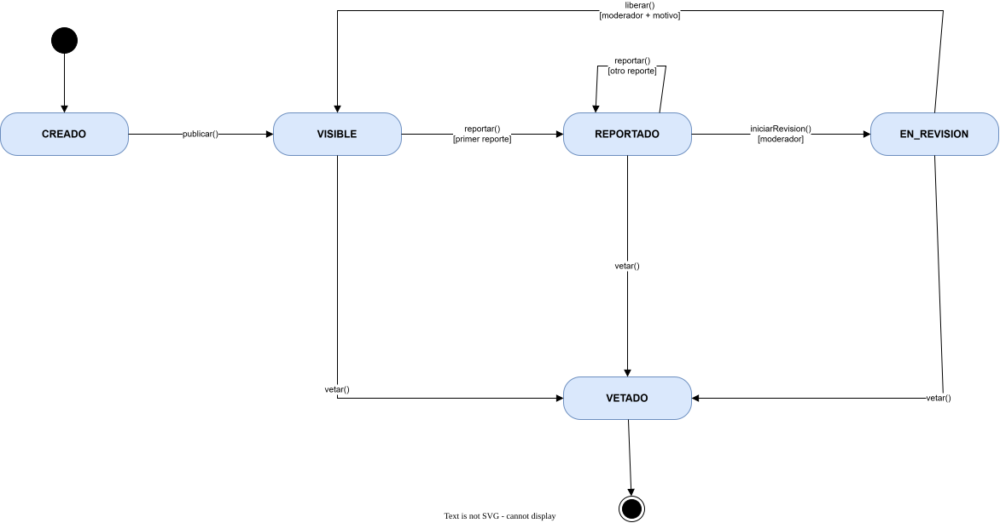](../../assets/diagramas/diagramas-estado-1.svg)

> También disponible en [PNG](../../assets/diagramas/diagramas-estado-1.png).

Versión en texto del diagrama (Mermaid)

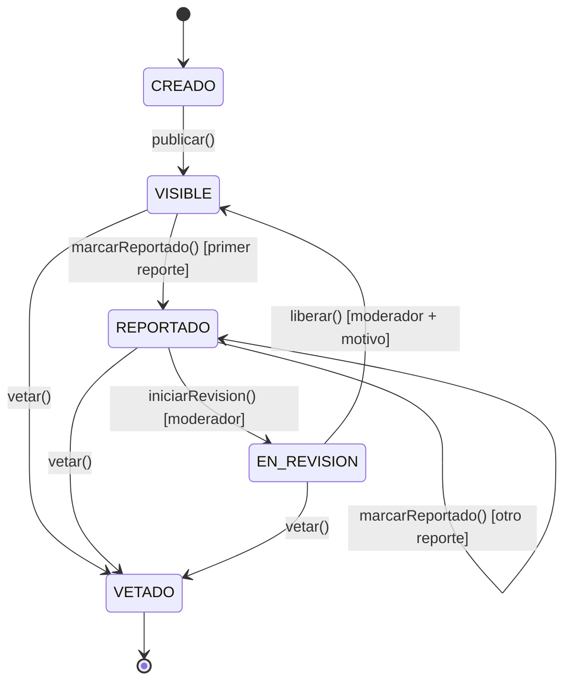
```mermaid
stateDiagram-v2
    [*] --> CREADO
    CREADO --> VISIBLE : publicar()
    VISIBLE --> REPORTADO : marcarReportado() [primer reporte]
    REPORTADO --> REPORTADO : marcarReportado() [otro reporte]
    REPORTADO --> EN_REVISION : iniciarRevision() [moderador]
    EN_REVISION --> VISIBLE : liberar() [moderador + motivo]
    VISIBLE --> VETADO : vetar()
    REPORTADO --> VETADO : vetar()
    EN_REVISION --> VETADO : vetar()
    VETADO --> [*]
```

### Estado de la cuenta

Ciclo de vida de la cuenta de usuario (RN-084 a RN-089, RN-216, RN-217, D-07, D-17).

[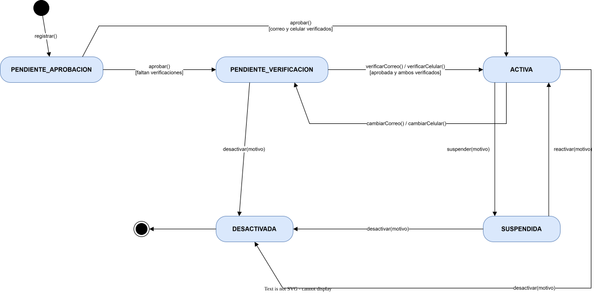](../../assets/diagramas/diagramas-estado-2.svg)

> También disponible en [PNG](../../assets/diagramas/diagramas-estado-2.png).

Versión en texto del diagrama (Mermaid)

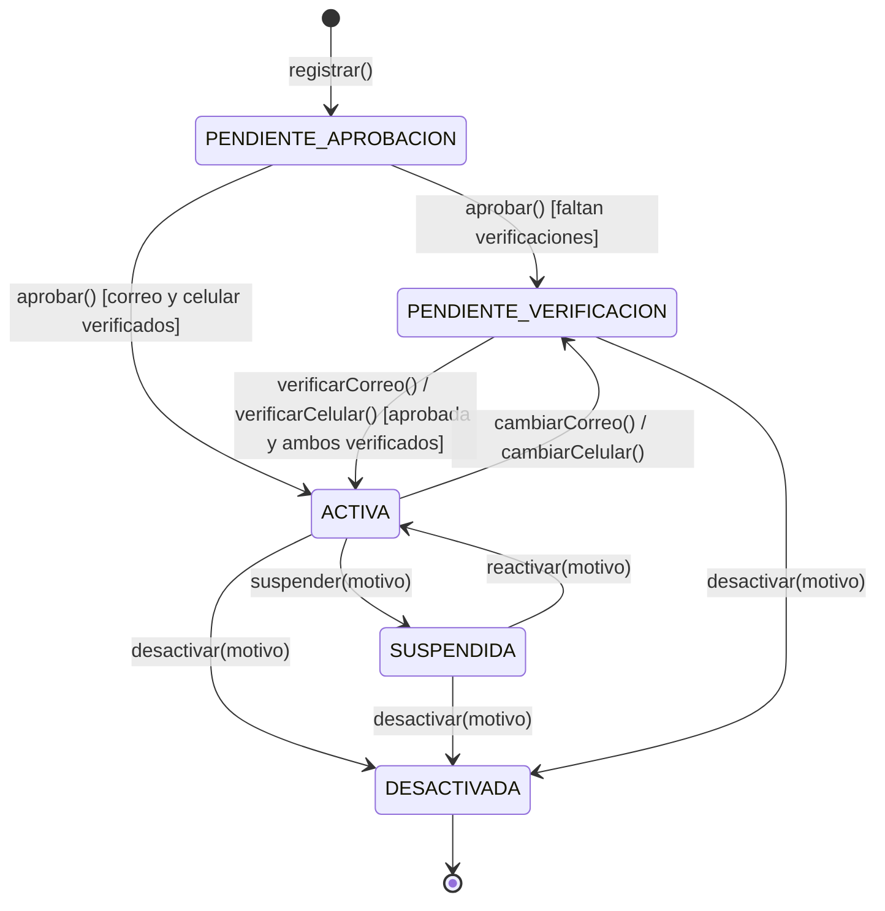
```mermaid
stateDiagram-v2
    [*] --> PENDIENTE_APROBACION : registrar()
    PENDIENTE_APROBACION --> PENDIENTE_VERIFICACION : aprobar() [faltan verificaciones]
    PENDIENTE_APROBACION --> ACTIVA : aprobar() [correo y celular verificados]
    PENDIENTE_VERIFICACION --> ACTIVA : verificarCorreo() / verificarCelular() [aprobada y ambos verificados]
    ACTIVA --> PENDIENTE_VERIFICACION : cambiarCorreo() / cambiarCelular()
    ACTIVA --> SUSPENDIDA : suspender(motivo)
    SUSPENDIDA --> ACTIVA : reactivar(motivo)
    ACTIVA --> DESACTIVADA : desactivar(motivo)
    SUSPENDIDA --> DESACTIVADA : desactivar(motivo)
    PENDIENTE_VERIFICACION --> DESACTIVADA : desactivar(motivo)
    DESACTIVADA --> [*]
```

### Estado del reporte

Ciclo de vida del reporte (RN-210 a RN-212, D-24).

[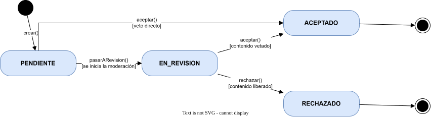](../../assets/diagramas/diagramas-estado-3.svg)

> También disponible en [PNG](../../assets/diagramas/diagramas-estado-3.png).

Versión en texto del diagrama (Mermaid)

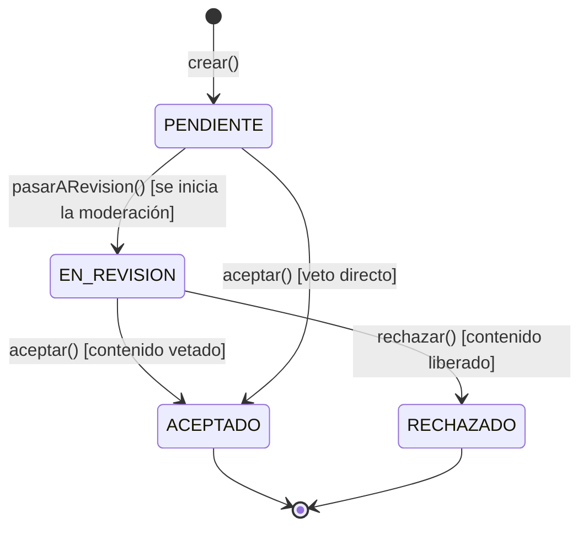
```mermaid
stateDiagram-v2
    [*] --> PENDIENTE : crear()
    PENDIENTE --> EN_REVISION : pasarARevision() [se inicia la moderación]
    EN_REVISION --> ACEPTADO : aceptar() [contenido vetado]
    EN_REVISION --> RECHAZADO : rechazar() [contenido liberado]
    PENDIENTE --> ACEPTADO : aceptar() [veto directo]
    ACEPTADO --> [*]
    RECHAZADO --> [*]
```

### Estado de la solicitud de registro

Ciclo de vida de la solicitud (RN-090 a RN-093, RN-108, D-17).

[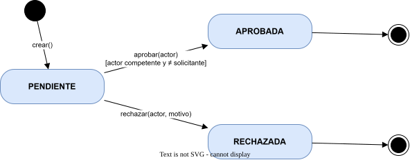](../../assets/diagramas/diagramas-estado-4.svg)

> También disponible en [PNG](../../assets/diagramas/diagramas-estado-4.png).

Versión en texto del diagrama (Mermaid)

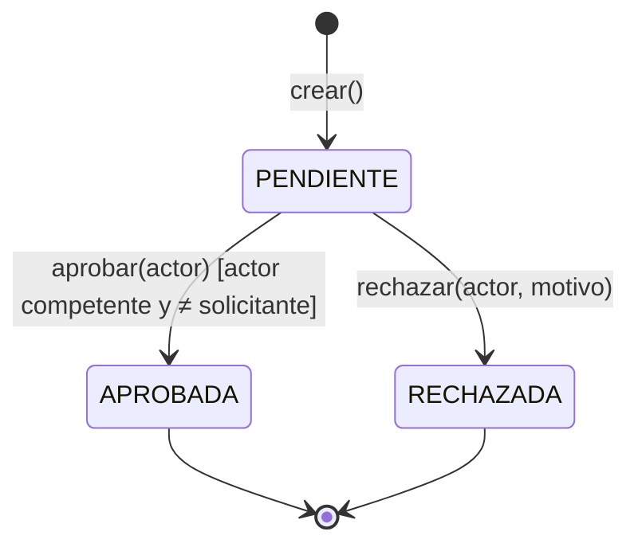
```mermaid
stateDiagram-v2
    [*] --> PENDIENTE : crear()
    PENDIENTE --> APROBADA : aprobar(actor) [actor competente y ≠ solicitante]
    PENDIENTE --> RECHAZADA : rechazar(actor, motivo)
    APROBADA --> [*]
    RECHAZADA --> [*]
```

### Estado de la Facultad

Ciclo de vida de la Facultad (RN-045, D-05).

[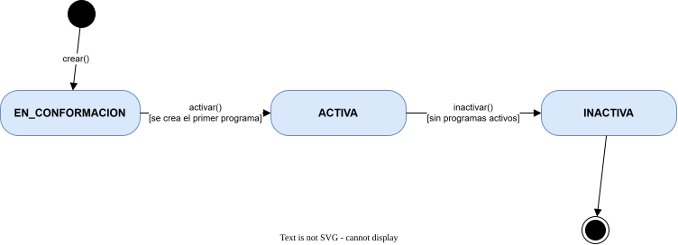](../../assets/diagramas/diagramas-estado-5.svg)

> También disponible en [PNG](../../assets/diagramas/diagramas-estado-5.png).

Versión en texto del diagrama (Mermaid)

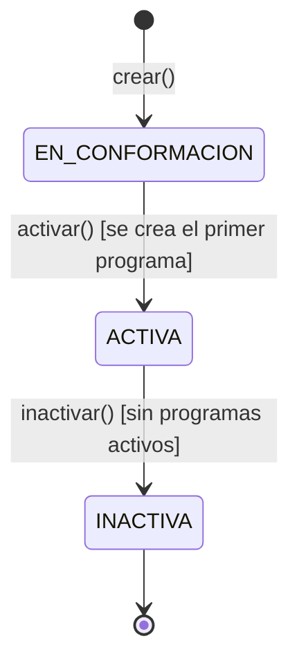
```mermaid
stateDiagram-v2
    [*] --> EN_CONFORMACION : crear()
    EN_CONFORMACION --> ACTIVA : activar() [se crea el primer programa]
    ACTIVA --> INACTIVA : inactivar() [sin programas activos]
    INACTIVA --> [*]
```

### Estado de la moderación

Ciclo de vida de la moderación (RN-239, RN-240, RN-250).

[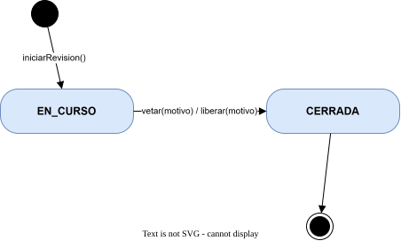](../../assets/diagramas/diagramas-estado-6.svg)

> También disponible en [PNG](../../assets/diagramas/diagramas-estado-6.png).

Versión en texto del diagrama (Mermaid)

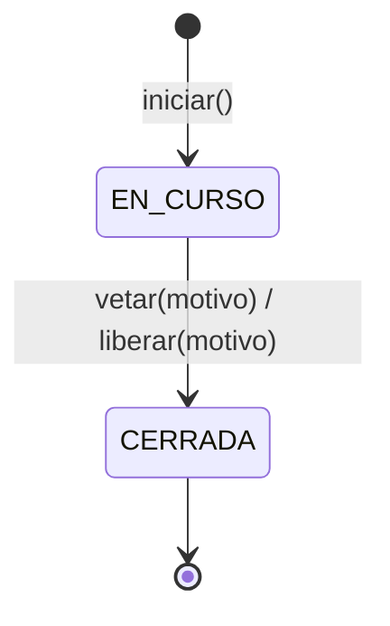
```mermaid
stateDiagram-v2
    [*] --> EN_CURSO : iniciar()
    EN_CURSO --> CERRADA : vetar(motivo) / liberar(motivo)
    CERRADA --> [*]
```

## 2. Diagramas de actividad (UML-004)

### Registro y activación de una cuenta

Desde que la persona se registra hasta que puede ingresar (CU-016, CU-017, CU-022, RN-084 a RN-093).

[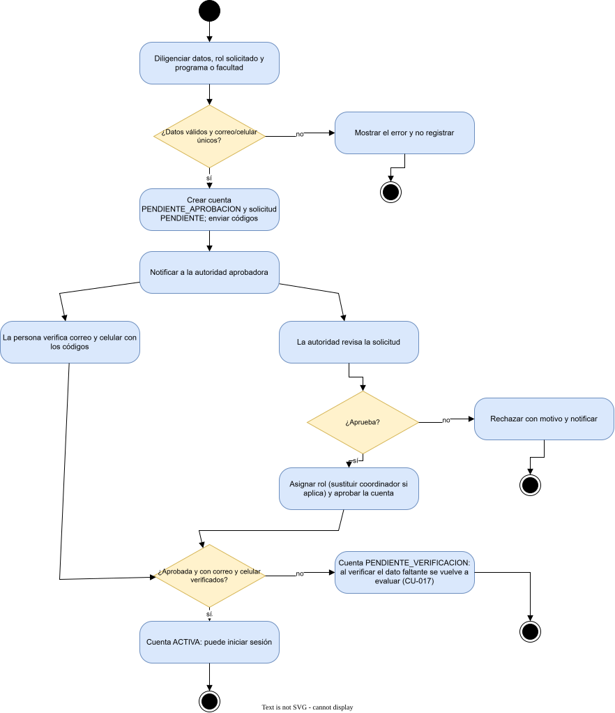](../../assets/diagramas/diagramas-actividad-1.svg)

> También disponible en [PNG](../../assets/diagramas/diagramas-actividad-1.png).

Versión en texto del diagrama (Mermaid)

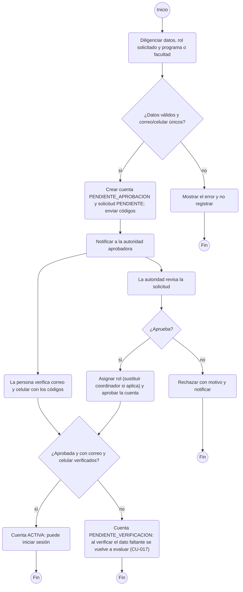
```mermaid
flowchart TD
    i((Inicio))
    a1("Diligenciar datos, rol solicitado y programa o facultad")
    d1{"¿Datos válidos y correo/celular únicos?"}
    a2("Mostrar el error y no registrar")
    a3("Crear cuenta PENDIENTE_APROBACION y solicitud PENDIENTE; enviar códigos")
    a4("Notificar a la autoridad aprobadora")
    a5("La persona verifica correo y celular con los códigos")
    a6("La autoridad revisa la solicitud")
    d2{"¿Aprueba?"}
    a7("Rechazar con motivo y notificar")
    a8("Asignar rol (sustituir coordinador si aplica) y aprobar la cuenta")
    d3{"¿Aprobada y con correo y celular verificados?"}
    a9("Cuenta ACTIVA: puede iniciar sesión")
    a10("Cuenta PENDIENTE_VERIFICACION: al verificar el dato faltante se vuelve a evaluar (CU-017)")
    f((Fin))
    f2((Fin))
    f3((Fin))
    f4((Fin))
    i --> a1
    a1 --> d1
    d1 -->|no| a2
    a2 --> f2
    d1 -->|sí| a3
    a3 --> a4
    a4 --> a5
    a4 --> a6
    a6 --> d2
    d2 -->|no| a7
    a7 --> f3
    d2 -->|sí| a8
    a8 --> d3
    a5 --> d3
    d3 -->|sí| a9
    d3 -->|no| a10
    a10 --> f4
    a9 --> f
```

### Moderación de contenido

Desde el reporte de un contenido hasta la decisión del moderador (CU-010 a CU-014, CU-036, CU-037).

[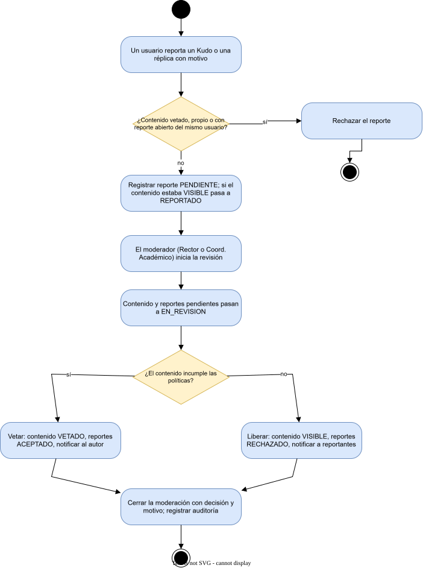](../../assets/diagramas/diagramas-actividad-2.svg)

> También disponible en [PNG](../../assets/diagramas/diagramas-actividad-2.png).

Versión en texto del diagrama (Mermaid)

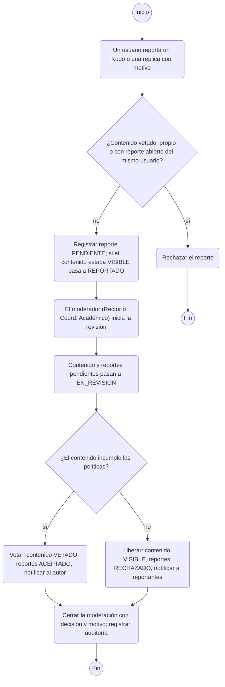
```mermaid
flowchart TD
    i((Inicio))
    a1("Un usuario reporta un Kudo o una réplica con motivo")
    d1{"¿Contenido vetado, propio o con reporte abierto del mismo usuario?"}
    a2("Rechazar el reporte")
    a3("Registrar reporte PENDIENTE; si el contenido estaba VISIBLE pasa a REPORTADO")
    a4("El moderador (Rector o Coord. Académico) inicia la revisión")
    a5("Contenido y reportes pendientes pasan a EN_REVISION")
    d2{"¿El contenido incumple las políticas?"}
    a6("Vetar: contenido VETADO, reportes ACEPTADO, notificar al autor")
    a7("Liberar: contenido VISIBLE, reportes RECHAZADO, notificar a reportantes")
    a8("Cerrar la moderación con decisión y motivo; registrar auditoría")
    f((Fin))
    f2((Fin))
    i --> a1
    a1 --> d1
    d1 -->|sí| a2
    a2 --> f2
    d1 -->|no| a3
    a3 --> a4
    a4 --> a5
    a5 --> d2
    d2 -->|sí| a6
    d2 -->|no| a7
    a6 --> a8
    a7 --> a8
    a8 --> f
```

### Publicar un Kudo y conversar

Creación de un Kudo, réplicas y calificaciones (CU-001, CU-004, CU-005, CU-007).

[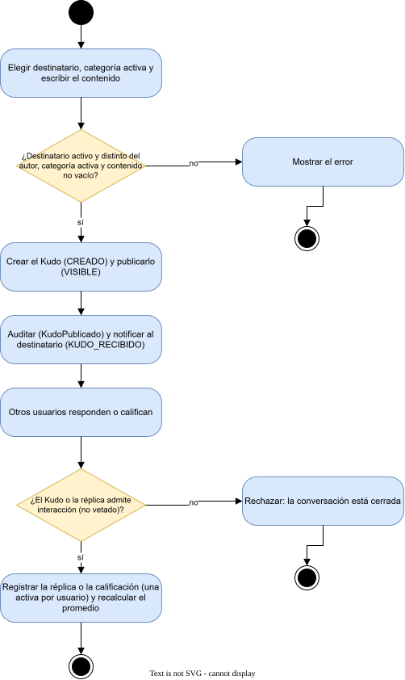](../../assets/diagramas/diagramas-actividad-3.svg)

> También disponible en [PNG](../../assets/diagramas/diagramas-actividad-3.png).

Versión en texto del diagrama (Mermaid)

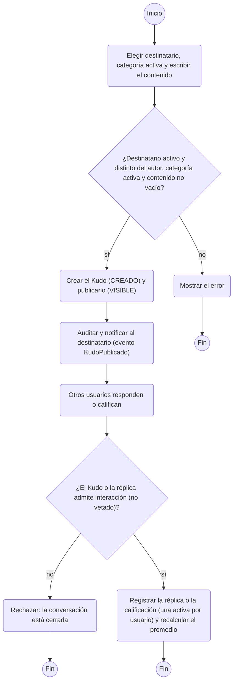
```mermaid
flowchart TD
    i((Inicio))
    a1("Elegir destinatario, categoría activa y escribir el contenido")
    d1{"¿Destinatario activo y distinto del autor, categoría activa y contenido no vacío?"}
    a2("Mostrar el error")
    a3("Crear el Kudo (CREADO) y publicarlo (VISIBLE)")
    a4("Auditar y notificar al destinatario (evento KudoPublicado)")
    a5("Otros usuarios responden o califican")
    d2{"¿El Kudo o la réplica admite interacción (no vetado)?"}
    a6("Rechazar: la conversación está cerrada")
    a7("Registrar la réplica o la calificación (una activa por usuario) y recalcular el promedio")
    f((Fin))
    f2((Fin))
    f3((Fin))
    i --> a1
    a1 --> d1
    d1 -->|no| a2
    a2 --> f2
    d1 -->|sí| a3
    a3 --> a4
    a4 --> a5
    a5 --> d2
    d2 -->|no| a6
    a6 --> f3
    d2 -->|sí| a7
    a7 --> f
```

## 3. Diagramas de secuencia (UML-003)

### Crear Kudo

CU-001. Muestra el recorrido por todas las capas, las reglas, el patrón State y la publicación del evento (Observer).

[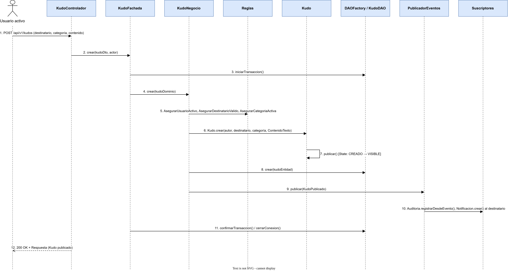](../../assets/diagramas/diagramas-secuencia-1.svg)

> También disponible en [PNG](../../assets/diagramas/diagramas-secuencia-1.png).

Versión en texto del diagrama (Mermaid)

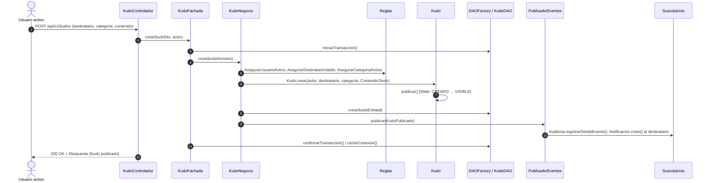
```mermaid
sequenceDiagram
    autonumber
    actor P0 as Usuario activo
    participant P1 as KudoControlador
    participant P2 as KudoFachada
    participant P3 as KudoNegocio
    participant P4 as Reglas
    participant P5 as Kudo
    participant P6 as DAOFactory / KudoDAO
    participant P7 as PublicadorEventos
    participant P8 as Suscriptores
    P0->>P1: POST /api/v1/kudos (destinatario, categoría, contenido)
    P1->>P2: crear(kudoDto, actor)
    P2->>P6: iniciarTransaccion()
    P2->>P3: crear(kudoDominio)
    P3->>P4: AsegurarUsuarioActivo, AsegurarDestinatarioValido, AsegurarCategoriaActiva
    P3->>P5: Kudo.crear(autor, destinatario, categoría, ContenidoTexto)
    P5->>P5: publicar()  [State: CREADO → VISIBLE]
    P3->>P6: crear(kudoEntidad)
    P3->>P7: publicar(KudoPublicado)
    P7->>P8: Auditoria.registrarDesdeEvento(), Notificacion.crear() al destinatario
    P2->>P6: confirmarTransaccion() / cerrarConexion()
    P1-->>P0: 200 OK + Respuesta (Kudo publicado)
```

### Aprobar solicitud de registro

CU-022. El servicio de aprobación coordina varios agregados en una sola transacción, incluida la sustitución de un coordinador.

[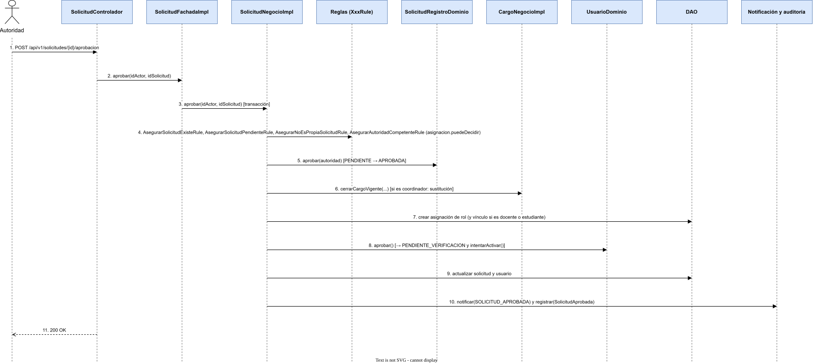](../../assets/diagramas/diagramas-secuencia-2.svg)

> También disponible en [PNG](../../assets/diagramas/diagramas-secuencia-2.png).

Versión en texto del diagrama (Mermaid)

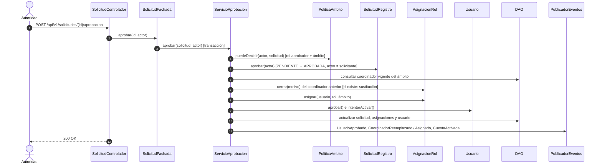
```mermaid
sequenceDiagram
    autonumber
    actor P0 as Autoridad
    participant P1 as SolicitudControlador
    participant P2 as SolicitudFachada
    participant P3 as ServicioAprobacion
    participant P4 as PoliticaAmbito
    participant P5 as SolicitudRegistro
    participant P6 as AsignacionRol
    participant P7 as Usuario
    participant P8 as DAO
    participant P9 as PublicadorEventos
    P0->>P1: POST /api/v1/solicitudes/{id}/aprobacion
    P1->>P2: aprobar(id, actor)
    P2->>P3: aprobar(solicitud, actor)  [transacción]
    P3->>P4: puedeDecidir(actor, solicitud)  [rol aprobador + ámbito]
    P3->>P5: aprobar(actor)  [PENDIENTE → APROBADA, actor ≠ solicitante]
    P3->>P8: consultar coordinador vigente del ámbito
    P3->>P6: cerrar(motivo) del coordinador anterior  [si existe: sustitución]
    P3->>P6: asignar(usuario, rol, ámbito)
    P3->>P7: aprobar() e intentarActivar()
    P3->>P8: actualizar solicitud, asignaciones y usuario
    P3->>P9: UsuarioAprobado, CoordinadorReemplazado / Asignado, CuentaActivada
    P1-->>P0: 200 OK
```

### Vetar contenido

CU-013 / CU-014. La decisión cambia la moderación, el contenido y sus reportes en una transacción.

[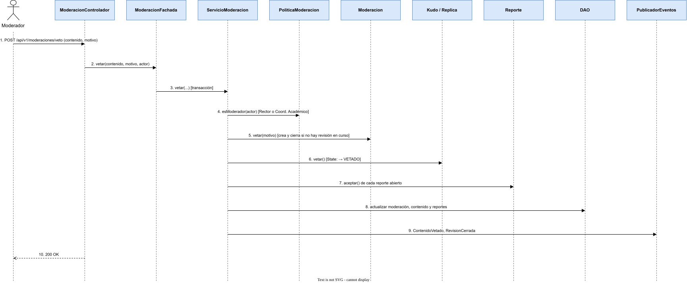](../../assets/diagramas/diagramas-secuencia-3.svg)

> También disponible en [PNG](../../assets/diagramas/diagramas-secuencia-3.png).

Versión en texto del diagrama (Mermaid)

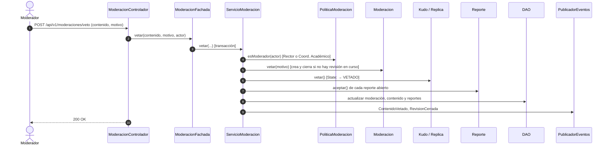
```mermaid
sequenceDiagram
    autonumber
    actor P0 as Moderador
    participant P1 as ModeracionControlador
    participant P2 as ModeracionFachada
    participant P3 as ServicioModeracion
    participant P4 as PoliticaModeracion
    participant P5 as Moderacion
    participant P6 as Kudo / Replica
    participant P7 as Reporte
    participant P8 as DAO
    participant P9 as PublicadorEventos
    P0->>P1: POST /api/v1/moderaciones/veto (contenido, motivo)
    P1->>P2: vetar(contenido, motivo, actor)
    P2->>P3: vetar(...)  [transacción]
    P3->>P4: esModerador(actor)  [Rector o Coord. Académico]
    P3->>P5: vetar(motivo)  [crea y cierra si no hay revisión en curso]
    P3->>P6: vetar()  [State: → VETADO]
    P3->>P7: aceptar() de cada reporte abierto
    P3->>P8: actualizar moderación, contenido y reportes
    P3->>P9: ContenidoVetado, RevisionCerrada
    P1-->>P0: 200 OK
```

### Verificar celular y activar la cuenta

CU-017. El código lo valida CodigoVerificacion y la activación la decide Usuario.

[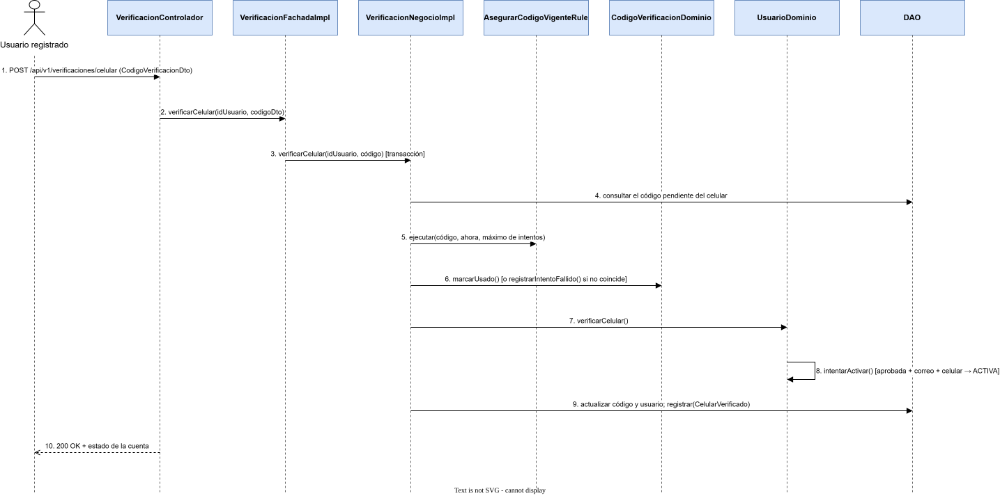](../../assets/diagramas/diagramas-secuencia-4.svg)

> También disponible en [PNG](../../assets/diagramas/diagramas-secuencia-4.png).

Versión en texto del diagrama (Mermaid)

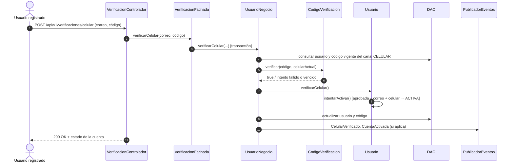
```mermaid
sequenceDiagram
    autonumber
    actor P0 as Usuario registrado
    participant P1 as VerificacionControlador
    participant P2 as VerificacionFachada
    participant P3 as UsuarioNegocio
    participant P4 as CodigoVerificacion
    participant P5 as Usuario
    participant P6 as DAO
    participant P7 as PublicadorEventos
    P0->>P1: POST /api/v1/verificaciones/celular (correo, código)
    P1->>P2: verificarCelular(correo, código)
    P2->>P3: verificarCelular(...)  [transacción]
    P3->>P6: consultar usuario y código vigente del canal CELULAR
    P3->>P4: verificar(código, celularActual)
    P4-->>P3: true / intento fallido o vencido
    P3->>P5: verificarCelular()
    P5->>P5: intentarActivar()  [aprobada + correo + celular → ACTIVA]
    P3->>P6: actualizar usuario y código
    P3->>P7: CelularVerificado, CuentaActivada (si aplica)
    P1-->>P0: 200 OK + estado de la cuenta
```

## Cómo se relacionan con el resto del diseño

- Cada **estado** corresponde a una enumeración del [modelo de dominio](../01-modelo-dominio/README.md#enumeraciones) y cada transición es un método de negocio de la clase (por ejemplo `vetar()` en [Kudo](../02-diagrama-clases/clases/Kudo.md)). El ciclo del contenido se implementa con el patrón **State** ([patrones](../05-arquitectura/patrones.md)).
- Cada **actividad** recorre varios casos de uso de la [especificación](../00-analisis/casos-de-uso.md) y muestra dónde se aplican las políticas.
- Cada **secuencia** sigue las capas de la [arquitectura](../05-arquitectura/README.md): controlador → fachada (transacción) → negocio (reglas y servicios de dominio) → dominio → DAO, y termina con la publicación de eventos que consumen la auditoría y las notificaciones.

